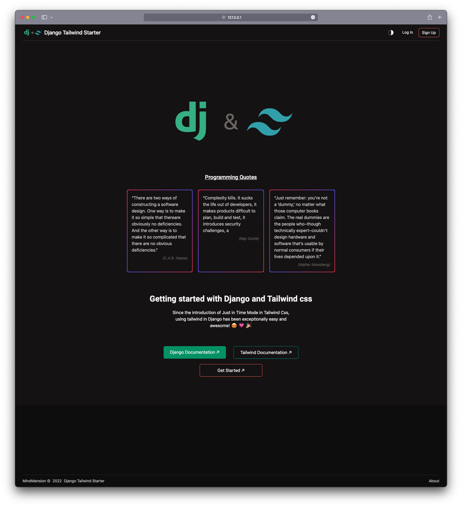

# Django Tailwind Starter

A simple starter kit for integrating TailwindCss in Django

## Full Installation

### 1. Clone the project
```bash
 git clone https://github.com/MindMansion/DjangoTailwindStarter.git
 cd DjangoTailwindStarter
```

### 2. Create your environment

```bash
    python3 -m venv virtual-env
    python -m venv virtual-env # on windows
    # activate env
    source virtual-env/bin/activate
```

### 3. install requirements

```bash
    pip install -r requirements.txt
```

### 4. getting tailwind ready
```bash
    cd theme
    npm install
    npm run build
    npm run watch # to keep the scss watcher alive 
    
    cd ..
```

### 5. Run
```bash
    python3 manage.py runserver
```
Then visit the link in your browser `http://127.0.0.1:8000`



### Quick Installation

If you already have a Django project, and you're only interested in 
including tailwind in your project, follow these steps.

### 1. create a directory
```bash
    mkdir theme
    cd theme
```

### 2. clone the tailwind setup folder
```bash
    npx degit https://github.com/MindMansion/DjangoTailwindStarter/theme
    npm run build
    npm run watch
```